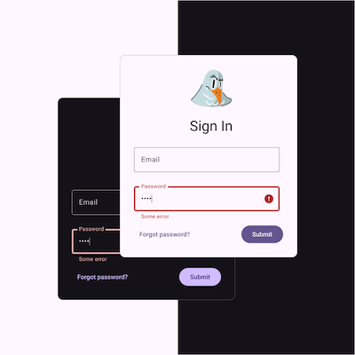

# Тестовое задание для фронтенд разработчика (Angular)

## Требования к развертыванию

- Результат должен быть размещен в публичном репозитории на GitHub
- Приложение запускается через Docker Compose (включить `Dockerfile` и `docker-compose.yml`)

## Стек
- Angular 18/19
- Организация проекта через NX Monorepo
- Стилизация с использованием SCSS (запрещены Tailwind, Material UI и другие библиотеки компонентов)

## Основное задание

### 1. Форма авторизации

#### Поля и валидация

- Поля:
  - Email:
    - Валидация формата
    - Ошибка: "Некорректный email"
  - Пароль:
    - Минимальная длина — 6 символов
    - Обязательные условия:
      - Минимум 1 заглавная буква
      - Минимум 1 цифра
      - Минимум 1 спецсимвол (например: `!@#$%^&*`)
    - Ошибки:
      - "Пароль слишком короткий" (если длина < 6)
      - "Пароль должен содержать заглавную букву, цифру и спецсимвол"
- Валидация отображается после потери фокуса/попытки отправки

#### Логика работы

- Использование Angular Reactive Forms с кастомными валидаторами
- Кнопка "Sign In" блокируется на время отправки запроса
- Моковый запрос:
  - Метод: `POST`
  - URL: `https://www.vl.ru/authtestcase/signin`
  - Тело запроса:
    ```json
    { "email": "user@example.com", "password": "Password123!" }
    ```
- Успешная авторизация:
  - Ответ от сервера:
    ```json
    {
      "token": "jwt_token",
      "user": {
        "id": 1,
        "name": "Steven Seagull"
      }
    }
    ```
  - Вывод сообщения "Welcome, {name}!" в `console.log`, где `name` – значение из ответа
- Неуспешный запрос
  - Пример ответа при неуспешной валидации:
    ```json
    {
      "errors": {
        "email": [
          "Invalid email address."
        ],
        "password": [
          "This value is too short. It should have 6 characters or more.",
          "The password must contain lowercase letter, uppercase letter, number and special character."
        ]
      }
    }
    ```
  - Предполагается, что при правильной валидации на стороне фронта, ошибки от бэкенда приходить не будут и их не придется отображать пользователю

### 2. Переключение тем (светлая/темная)

#### Требования
- Переключатель в правом верхнем углу страницы
- При первом посещение активна системная тема
- Сохранение выбранной темы после ручного переключения
  - При повторном открытии браузера/вкладки должна остаться выбранная тема

### 3. Дизайн



#### [Макет в Figma](https://www.figma.com/design/fiCZkBz502YGoegRFNz8LM/Auth-test-case?node-id=0-1&p=f)
- Форма центрирована по вертикали и горизонтали.
- Адаптивность:
  - На мобильных устройствах форма занимает всю ширину экрана (максимум 400px)
  - Переключатель темы адаптируется под малый экран (на усмотрение разработчика)


## Дополнительно (бонус)
- Плавный переход между темами
- A11Y (accessibility) – взаимодействие с формой с клавиатуры, поддержка screen reader'ов


## Критерии оценки
- Корректная работа формы и валидаций
- Сохранение выбранной темы между перезагрузками
- Соблюдение требований к стеку (NX Monorepo, SCSS)
- Чистота кода и документация в `README.md` (инструкции по запуску через Docker)
